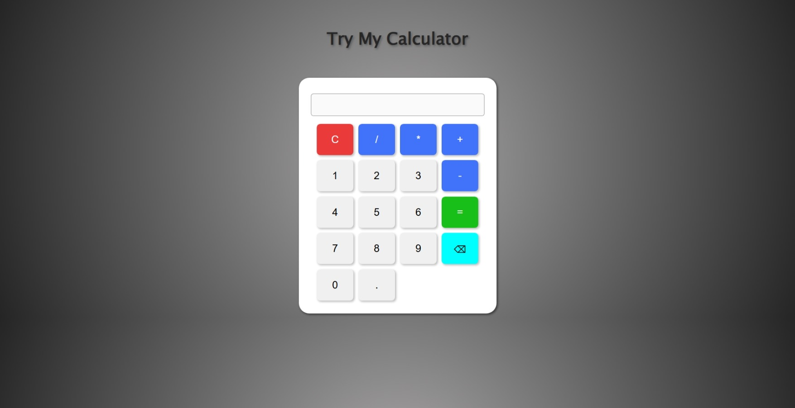

# 🔢 Simple Calculator

A basic calculator built using **HTML**, **CSS**, and **JavaScript**.  
Performs simple arithmetic operations like addition, subtraction, multiplication, and division.

## 🚀 Live Preview
> _You can upload the project to GitHub Pages or Netlify and put the link here._

---

## 🛠️ Features

- Responsive UI
- Real-time calculations
- Clear and Delete functionality
- User-friendly interface

---

## 📸 Preview



---

## 🧰 Technologies Used

- HTML5
- CSS3
- JavaScript (ES6)

---

## 📦 Installation

1. Clone the repository:
   ```bash
   git clone https://github.com/Omda-dev/calculator.git
